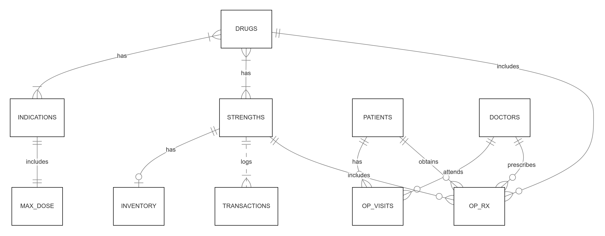

# Design Document

By LIM WEN YAN

Video overview: <(https://youtu.be/wFDLV9Gymt0)>

## Scope

The database for Epic Drug Info (DI) includes all entities necessary to facilitate common drug information questions in a primary healthcare setting. Hence, what is covered in the database’s scope includes:
 ⁃ Drugs which includes identification and information regarding its drug name and classification of its therapeutic effect
 ⁃ Indications which includes basic information on uses of various drugs
 ⁃ Max Dose which includes information on the maximum dosages of the drug based on its use (indication)
 ⁃ Strength which includes basic information of the various strengths the drug will come in
 ⁃ Inventory which includes information on the current inventory level in the system
 ⁃ Transactions which includes information of the transactions for each drug which will update the inventory levels
 ⁃ Patients which includes information on the various patients for our healthcare facility
 ⁃ Outpatient Visits which includes information on the date, times of the outpatient visits each patient takes and also their attending doctor
 ⁃ Outpatient Prescriptions which includes information on the different drugs that was prescribed by the attending based on a particular outpatient visit
 ⁃ Doctors includes information on the doctors and their identification numbers

Out of scope are elements such as inpatient visits, costs of drugs, drug-drug interactions and so on.

## Functional Requirements

This healthcare database will support functions such as:
* CRUD of drug records, indications of drugs, all strengths associated with each drug, transactions associated with each drug strength, patient and doctor records such as oupatient visits and outpatient prescriptions.
* The database shall associate each drug with one or more strengths that specify the maximum allowable doses for the drug for each drug indication pair. It can also link each drug to its medical indications.
* Tracking inventory levels for each drug and its strength to monitor available stock as well as logging transactions related to the inventory of each drug strength, such as stock increases or decreases. All transactions are also logged such as retrival of transaction history is possible for audit/reporting purposes.
* The database can also track patient and doctor records, it can track patients respective outpatient visitation records and it can also track the number of outpatient prescriptions issued to patients from the prescribing doctor. This can ensure correct doctor and correct patient for each outpatient prescription with the appropriate drugs and strengths.

## Representation

Entities are captured in SQLite tables with the following schema.

### Entities

#### Drugs

The `drugs` table includes:

* `id`, which specifies the unique ID for the drug as an `INTEGER`. This column thus has the `PRIMARY KEY` constraint applied.
* `drug_name`, which specifies the drug's name as `TEXT`, given `TEXT` is appropriate for name fields.
* `therapeutic_class`, which specifies the drug's therapeutic class it targets such as CVM for cardiovascular or PSY for psychiatry, etc. `TEXT` is used for the same reason as `drug_name`.

#### Indications

The `indications` table includes:

* `id`, which specifies the unique ID for the indications as an `INTEGER`. This column thus has the `PRIMARY KEY` constraint applied.
* `indication_name`, which specifies the indication's name as `TEXT`.

All columns in the `drugs` and `indications` table are required and hence should have the `NOT NULL` constraint applied. No other constraints are necessary.

#### Max Dose

The `max_dose` table includes:

* `drug_id`, which is the ID of the drug as an `INTEGER`. This column thus has the `FOREIGN KEY` constraint applied, referencing the `id` column in the `drugs` table to ensure data integrity.
* `indications_id`, which is the ID of the indication as an `INTEGER`. This column thus has the `FOREIGN KEY` constraint applied, referencing the `id` column in the `indications` table to ensure data integrity.
* `maximum_dose`, which is the column containing the drugs' max dose as per indication (e.g 120mg, 2.4g) set as `TEXT`. It is also required hence it has the `NOT NULL` constraint.

#### Strengths

The `strengths` table includes:

* `id`, which specifies the unique ID for the strengths of each drug as an `INTEGER`. This column thus has the `PRIMARY KEY` constraint applied.
* `drug_id`, which is the ID of the drug as an `INTEGER`. This column thus has the `FOREIGN KEY` constraint applied, referencing the `id` column in the `drugs` table to ensure data integrity.
* `strength_of_drug`, which is the column containing the strengths of the drugs e.g (25mg, 50mg, 100mg) set as `TEXT`. It is also required hence it has the `NOT NULL` constraint.

#### Inventory

The `inventory` table includes:

* `drug_id`, which is the ID of the drug as an `INTEGER`. This column thus has the `FOREIGN KEY` constraint applied, referencing the `id` column in the `drugs` table to ensure data integrity.
* `strengths_id`, which is the ID of the strength as an `INTEGER`. This column thus has the `FOREIGN KEY` constraint applied, referencing the `id` column in the `strengths` table to ensure data integrity.
* `balance`, which specifies the total balance inventory of a specific drug and its strength in the system hence it is labelled as an `INTEGER` data type. There might be no data in the system as we may not keep certain drugs on site. Hence a `NOT NULL` constraint is not applicable.

#### Transactions

The `transactions` table includes:

* `id`, which specifies the unique ID for the transaction of each drug an `INTEGER`. This column thus has the `PRIMARY KEY` constraint applied.
* `drug_id`, which is the ID of the drug as an `INTEGER`. This column thus has the `FOREIGN KEY` constraint applied, referencing the `id` column in the `drugs` table to ensure data integrity.
* `strengths_id`, which is the ID of the strength as an `INTEGER`. This column thus has the `FOREIGN KEY` constraint applied, referencing the `id` column in the `strengths` table to ensure data integrity.
* `transaction_changes`, which specifies the transactions of a certain drug of a particular strength either adding into the stock or deducting from the stock as an `INTEGER` data type. It is a required column hence the `NOT NULL` constraint is applicable.
* `transaction_date`, which specifies the timestamp at which the transaction was made/updated hence it is labelled as an `NUMERIC` data type. `transaction_date` attribute defaults to the current timestamp when a new row is inserted as denoted by `DEFAULT CURRENT_TIMESTAMP`.

#### Patients

The `patients` table includes:

* `id`, which specifies the unique ID for each patient as an `INTEGER`. This column thus has the `PRIMARY KEY` constraint applied.
* `pt_firstname`, which specifies the first name of the patient as `TEXT`.
* `pt_lastname`, which specifies the last name of the patient as `TEXT`.
* `gender`, which specifies the gender of the patient as `TEXT` with a `CHECK` constraint for the gender to only contain either M for male or F for female.
* `pt_NRIC`, which contains the contents of the columns as `TEXT`, given that `TEXT` can still store long-form text. A `UNIQUE` constraint ensures for patients with the same first name and last name are different in terms of their unique identifier number (e.g: TXXXX111F or SXXXX111G).

#### Doctors

The `doctors` table includes:

* `id`, which specifies the unique ID for each doctor as an `INTEGER`. This column thus has the `PRIMARY KEY` constraint applied.
* `dr_firstname`, which specifies the first name of the patient as `TEXT`.
* `dr_lastname`, which specifies the last name of the patient as `TEXT`.
* `dr_title`, which specifies the title of the doctor as `TEXT` with a `CHECK` constraint for the gender to only contain either Sr Con (Senior Consultant), Con (Consultant) or MO (Medical Officer).
* `dr_MCR`, which contains the contents of the columns as `TEXT`, given that `TEXT` can still store long-form text. A `UNIQUE` constraint ensures for doctors with the same first name and last name are different in terms of their unique medical license number (e.g: MXX111F).

#### Outpatient Vists

The `op_visits` table includes:

* `id`, which specifies the unique ID for each outpatient visit as an `INTEGER`. This column thus has the `PRIMARY KEY` constraint applied.
* `patients_id`, which is the ID of the patient as an `INTEGER`. This column thus has the `FOREIGN KEY` constraint applied, referencing the `id` column in the `patients` table to ensure data integrity.
* `visit_type`, which specifies the type of outpatient visit the patient has as a `TEXT`. This column is requred hence the `NOT NULL` constraint is applicable.
* `timestamp`, which specifies the timestamp at which the outpatient visit is scheduled hence it is labelled as an `NUMERIC` data type. This column is requred hence the `NOT NULL` constraint is applicable.
* `doctors_id`, which is the ID of the attending doctor as an `INTEGER`. This column thus has the `FOREIGN KEY` constraint applied, referencing the `id` column in the `doctors` table to ensure data integrity.

#### Outpatient Prescriptions

The `op_rx` table includes:

* `patients_id`, which is the ID of the patient as an `INTEGER`. This column thus has the `FOREIGN KEY` constraint applied, referencing the `id` column in the `patients` table to ensure data integrity.
* `doctors_id`, which is the ID of the attending doctor as an `INTEGER`. This column thus has the `FOREIGN KEY` constraint applied, referencing the `id` column in the `doctors` table to ensure data integrity.
* `drug_id`, which is the ID of the drug that is prescribed as an `INTEGER`. This column thus has the `FOREIGN KEY` constraint applied, referencing the `id` column in the `drugs` table to ensure data integrity.
* `strengths_id`, which is the ID of the strength as an `INTEGER`. This column thus has the `FOREIGN KEY` constraint applied, referencing the `id` column in the `strengths` table to ensure data integrity.
* `timestamp`, which specifies the timestamp at which the outpatient visit is scheduled hence it is labelled as an `NUMERIC` data type. This column is requred hence the `NOT NULL` constraint is applicable. The `timestamp` attribute defaults to the current timestamp when a new row is inserted as denoted by `DEFAULT CURRENT_TIMESTAMP`.

### Relationships

This entity relationship diagram represents a system for managing drug-related data, tracking inventory, handling transactions, and linking patients with their respective doctors and prescriptions. The interconnectedness of the entities and their relationships ensures all relevant aspects of patient care and drug management are captured within the system.

As detailed by the diagram:

* Each drug either comes in one or multiple strenghts and have certain indications which are the medical condition they are prescribed for either has one or multiple indications it can treat. It can either can be prescribed in many outpatient prescriptions or none.
* Within a certain indication where a drug is being used, it is related to it's maximum dose definining the upper limit of dosage for safety reasons. This is a one to one relationship as only a particular indication has one maximum dose for a particular drug
* Strengths are associated with transactions that involve their usage or distribution either the hospital keeps none of it in the inventory or only a particular strength has a particular inventory balance. It also logs transactions in which a particular strength has either one to many transactions. It is also similar with drugs relationship with outpatient prescription, either a particular strength is prescribed in many prescriptions or none.
* Patients are associated with outpatient visits with each individual patient is associated with either no visits or multiple visits and they also obtain outpatient prescriptions with a similar association to outpatient vists.
* Doctors are then associated with outpatient visits as they attend to their patients during the visit and also prescribed medications to patients in outpatient prescriptions with a none to many patients to see and also none to many prescriptions prescribed.

## Optimizations

Per the typical queries in `queries.sql`, it is common for users to either search for details regarding a particular drug, patient or indication. Hence indexes are created on the `drug_name` column in the "drugs" table, the `pt_firstname` and `pt_lastname` column in the "patients" table, the `indications_name` column in the "indications" table.

Next, views can be created to better visualise the drugs with their particular indication and max dose as its own 'table' and it will be easier to query for a particular drug and their indications that one may be curious about finding which can all be seen in one table. Another view is also created to visualise patients particulars with their outpatient visit type as well as prescription drug and strength details.

## Limitations

These are just basic drug information questions that may come up in a pharmacists line of work. Further complicated questions include finding out drug-drug interactions for a certain drug for patient safety, cost of the drugs that we have to reduce patients pill burden etc. All of these questions can be answered with more entities in our database.

However, answering clinical questions sometimes rely heavily on a healthcare professional’s clinical judgement as well and not really having to strictly rely on a strict database. As with new found clinical guidelines, the updating of databases would be tedious as well.
